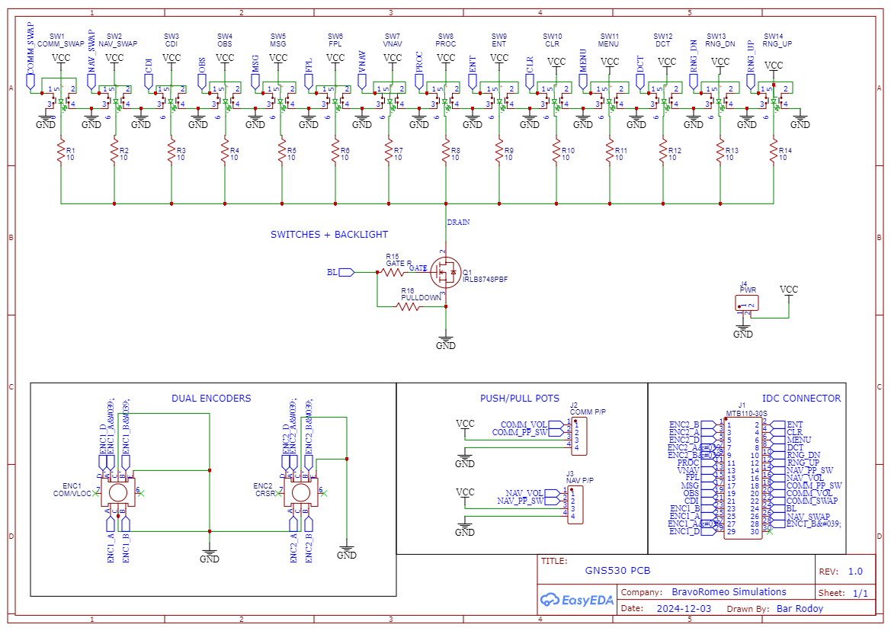

# GNS530 Replica for Microsoft Flight Simulator

This is a custom-built GNS530 panel replica designed to interface with **Microsoft Flight Simulator 2020 (MSFS)** using **MobiFlight**. The system connects a physical interface to the simulator via an **Arduino Nano**, offering a realistic and immersive GPS experience for general aviation enthusiasts.

> 🚧 **This project is a work in progress.** Final assembly, wiring, and MobiFlight configuration are still being refined.

## Bill of Materials (BOM)

| Component | Description |
|----------|-------------|
| **Display** | ZJ050NA-08C 5-inch 800x480 TFT with HDMI control board |
| **Main Control** | Arduino Nano (via USB) |
| **Volume/Squelch Knobs** | 2 × Alpha A-type push/pull potentiometers, 25KΩ |
| **Panel Inputs** | 16 tactile switches (LED-illuminated 6×6 TS-H002) |
| **Rotary Encoders** | Dual concentric and single rotary encoders for input selection |
| **PCB** | Custom main PCB + adapter board to mux board |
| **Multiplexer** | HW-178 16-channel CD74HC4067 mux module |
| **Power** | 12V DC input with DC-DC converter to 5V |
| **Connectors** | JST XH 2/4/6-pin connectors, 30-pin IDC ribbon cable |
| **3D Printed Parts** | Full front panel, encoder shafts, actuator rods for switches |

## Block Diagram
  

## PCB Drawing:

## Images

